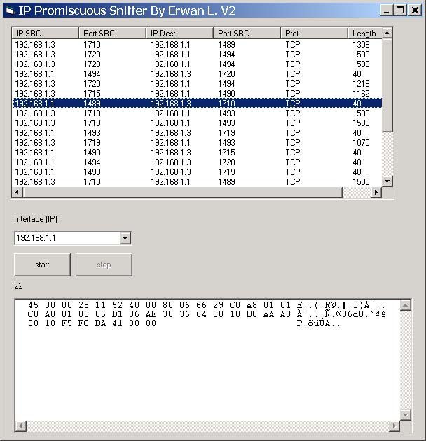



## Promiscuous IP Sniffer

### Description

See all traffic on you network (promiscuous mode):

source ip, destination ip, source port, destination port, packet length, ip protocol.

works only on w2k and xp.

no driver needed, this piece of code use the new implementation of winsock.

the v2.0 now displays the informations in nicer way and it also displays the content of the packet (hexa & ascii).
 
### More Info
 

             |
---                |---
**Submitted On**   |2003-01-04 19:14:48
**By**             |[Erwan L\.](https://github.com/Planet-Source-Code/PSCIndex/blob/master/ByAuthor/erwan-l.md)
**Level**          |Advanced
**User Rating**    |5.0 (269 globes from 54 users)
**Compatibility**  |VB 6\.0
**Category**       |[Windows API Call/ Explanation](https://github.com/Planet-Source-Code/PSCIndex/blob/master/ByCategory/windows-api-call-explanation__1-39.md)
**World**          |[Visual Basic](https://github.com/Planet-Source-Code/PSCIndex/blob/master/ByWorld/visual-basic.md)
**Archive File**   |[Promiscuou1527121102003\.zip](https://github.com/Planet-Source-Code/erwan-l-promiscuous-ip-sniffer__1-42170/archive/master.zip)

